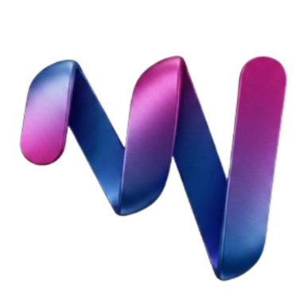
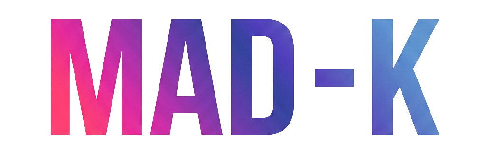
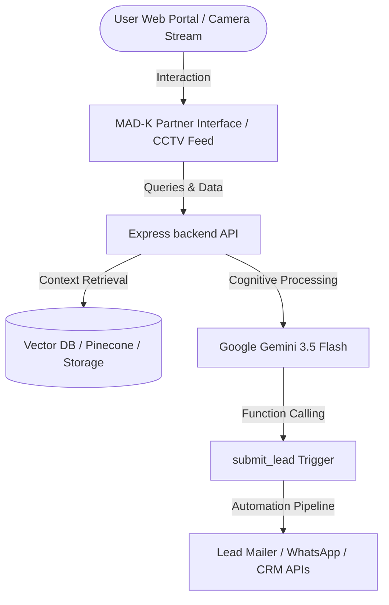

<div align="center">
  
  <br />
  
  
  <h3><strong>High-Performance Gen-AI Agents & Full-Stack Automation Engines</strong></h3>
  <p>We build production-ready digital solutions that turn standard websites into active lead machines.</p>

  <p>
    
    
    
    
    
  </p>
</div>

---

## 🌌 About MAD-K
MAD-K is an engineering partner specializing in constructing high-fidelity AI assistants, custom business process automations, and intelligent computer vision platforms. 

Evolving from a freelance collective to a structured team of software engineers, UI/UX designers, and systems architects, we design, deploy, and maintain bespoke solutions for businesses aiming to optimize workflow conversion metrics.

---

## 🛡️ Core Capabilities



- **RAG Chatbots**: Direct vector database grounding (Pinecone/Milvus) with LLMs to query and answer based on proprietary business data.
- **Process Automation**: Scalable Python engines built with Celery, Puppeteer, and Selenium to schedule and run workflows.
- **AI Web Applications**: Full-stack Reactive architectures with motion libraries for sub-second loading states.
- **Computer Vision & Detection**: PyTorch, OpenCV, and YOLO implementations for anti-theft alerts, PPE compliance, and CCTV stream telecasting.

---

## 🏷️ Service Tiers & Pricing

| Tier | Price Range | Duration / Model | Key Details |
| :--- | :--- | :--- | :--- |
| **Basic Portfolio** | **₹6,000 - ₹15,000** | / week | Static portfolio layout, customized responsive structure, integrated enquiry forms. |
| **Advanced Portfolio** | **₹20,000 - ₹45,000** | / week | Interactive AI Chat assistant (Gemini/OpenAI), lead mailers, Google reviews fetcher & highlighting engine (API key requirements excluded). |
| **Dedicated Automation** | **Starts from ₹50,000** | / custom quoted | Task, workflow, or pipeline automation scripts, onsite deployment and setup, 1-year support & AMC packages. |
| **AI Detection Systems** | **Starts from ₹50,000** | / custom quoted | Computer vision setups (CCTV integration, anti-theft burglar alerts, PPE compliance checking) with public telecast stream support. |

---

## 🚀 Running Locally

### Prerequisites
Ensure you have [Node.js](https://nodejs.org/) installed.

1. **Install dependencies:**
   ```bash
   npm install
   ```

2. **Configure environment variables:**
   Create a `.env` file in the root folder and add your Google Gemini API key:
   ```env
   GEMINI_API_KEY=your_google_gemini_api_key_here
   ```

3. **Run the development server:**
   ```bash
   npm run dev
   ```
   *The application will boot in development mode and serve the landing page.*
